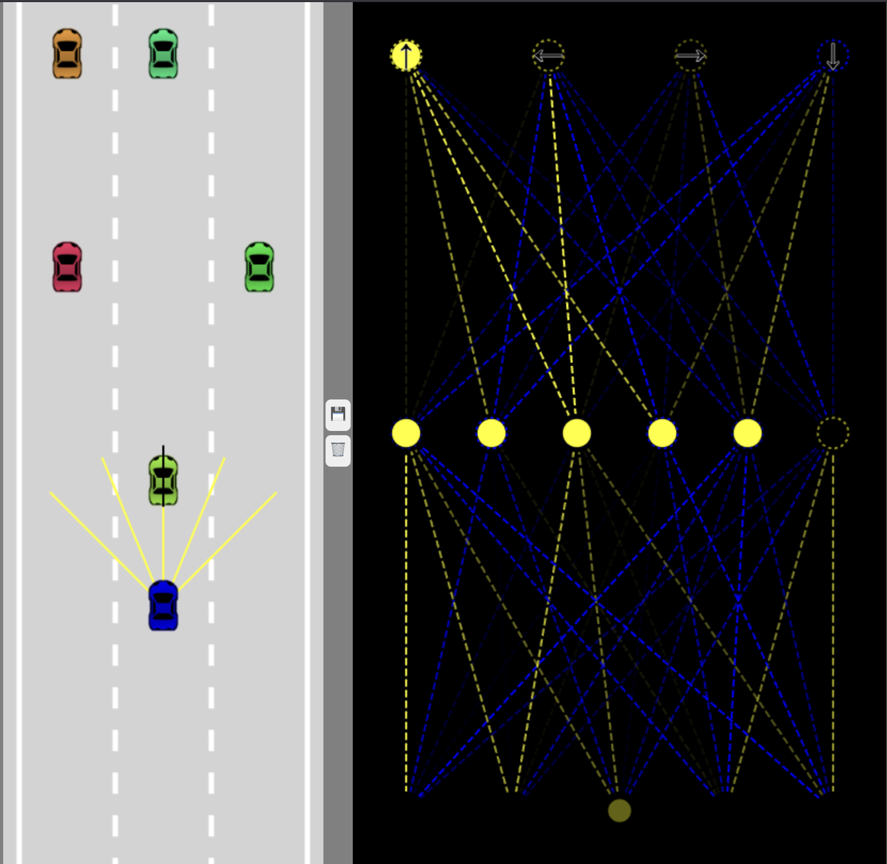

🚗 Self-Driving Car Simulation

A browser-based neural network simulation that learns how to drive — built with pure JavaScript, no frameworks, and lots of math.

  

🧠 Overview

This project simulates a self-driving car powered by a custom-built neural network, realistic physics, and sensor-based perception — all written from scratch using vanilla JavaScript and the HTML5 Canvas API.

It’s inspired by Radu Mariescu-Istodor’s “Self-Driving Car from Scratch” course, expanding it with modular components and a polished interface.

✨ Features
Feature	Description
🧩 Neural Network AI	Multi-layer network that controls the car using sensor data
🔭 Ray-Casting Sensors	Dynamic environment detection using 5 configurable beams
⚙️ Realistic Physics	Acceleration, friction, and angular steering modeled physically
🚗 Traffic Simulation	AI car avoids dummy vehicles and road borders intelligently
🧱 Collision Detection	Polygon-based intersection algorithm for realistic crashes
🎥 Real-Time Visualization	Watch sensor rays and decision logic in action
🏗️ Architecture Overview
Core Components

Car – Physics, rendering, and AI integration

Controls – Keyboard & AI input mapping

Sensor – Ray-casting environment detection

NeuralNetwork – Multi-layer feedforward system

Road – Lane generation and rendering

Utils – Geometry and interpolation helpers

Neural Network Layout
Input Layer   →   Hidden Layer   →   Output Layer
   (5)               (6)               (4)
Sensors        Processing      Forward | Left | Right | Reverse

🕹️ Controls
Mode	Description
🧍 Manual	Control with arrow keys (↑ ↓ ← →)
🤖 AI Mode	Neural network makes driving decisions
🚀 Getting Started
1️⃣ Clone the Repository
git clone https://github.com/yourusername/self-driving-car.git
cd self-driving-car

2️⃣ Launch the Simulation

Simply open index.html in your web browser — no dependencies required.

3️⃣ Watch the AI Drive

You’ll see:

🟦 Blue car → Your AI

🟥 Red cars → Traffic

🟡 Yellow rays → Sensor readings

⚙️ Configuration

Modify parameters in car.js or sensor.js to tune performance:

// Car physics
maxSpeed = 4
acceleration = 0.2
friction = 0.05

// Sensor setup
rayCount = 5
rayLength = 150
raySpread = Math.PI / 2

// Neural Network
layers = [5, 6, 4]

📊 How It Works

Sensors detect nearby obstacles and roads

Readings are normalized (0 → near, 1 → far)

Neural Network processes inputs → outputs steering & throttle

Physics Engine updates position based on forces

Collision System handles impacts and resets logic

🧬 AI & Learning

Currently, the AI uses random weights for its neural network — each run generates unique “personalities.”
You can enhance it using:

🧠 Genetic algorithms for training

🏁 Evolutionary fitness scoring

💾 Save/load model states

🔄 Multi-generation car evolution

🛠️ Tech Stack
Technology	Purpose
🟨 JavaScript (ES6+)	Core simulation logic
🟥 HTML5 Canvas	Real-time rendering
⚫ Neural Networks	Decision-making logic
⚪ Ray Casting	Sensor-based perception
🎨 Visual Key
Element	Description
🟦 Blue Car	AI-controlled vehicle
🟥 Red Cars	Dummy traffic vehicles
🟡 Yellow Rays	Active sensor beams
⚫ Black Rays	Extended sensor reach
⚪ White Lines	Road lane markings
📁 File Structure
├── index.html        # Entry point
├── car.js            # Car physics + AI
├── controls.js       # Input handlers
├── network.js        # Neural network
├── sensor.js         # Ray casting
├── road.js           # Road generator
├── utils.js          # Helper functions
└── assets/           # Car images or demo media

🔮 Future Enhancements

 Genetic algorithm for AI training

 Multi-AI competition mode

 Real-time neural network visualizer

 Different tracks and terrains

 Scoreboards and performance metrics

 Weather and environment simulation

🧑‍💻 Author

Sinoy De
B.Tech in Computer Science (Cybersecurity)
Google Developer Student Committee • Secretary, IncuBeta • Project Analyst @ AIC-RRU

    

🏁 Acknowledgments

🎓 Radu Mariescu-Istodor – for the foundational self-driving car course

💡 The open web ecosystem (Canvas + JS)

👩‍💻 Developers who learn by building things from scratch